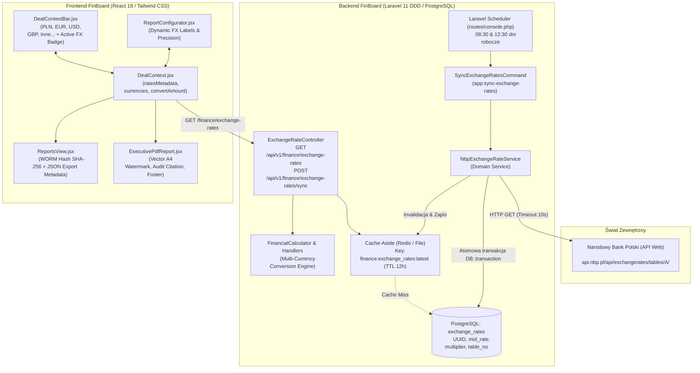
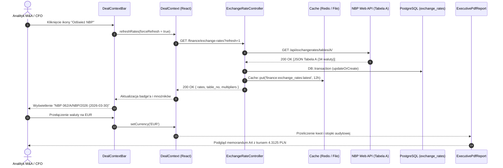

# FinBoard Architecture: Silnik Kursów Walut NBP i Architektura Wielowalutowa (Constant FX)

**Wersja:** 1.0  
**Data wydania:** 29 września 2026  
**Kontekst:** Architektura Wielowalutowa i Raportowanie M&A Deal Advisory (Laravel 11 DDD + PostgreSQL + React 18 + Tailwind CSS)  
**Status:** Produkcyjny (Faza 61, Commity 308–317)  

---

## 1. Wprowadzenie i Kontekst Finansowo-Prawny

System transakcyjny **FinBoard** wspiera procesy **Deal Advisory, M&A (Fuzje i Przejęcia) oraz Corporate Finance**, operując na wycenach DCF, analizach EBITDA, kapitału obrotowego netto (NWC) oraz raportach Due Diligence.

Dotychczasowy system operował na uproszczonych, statycznych mnożnikach zapisanych w kodzie frontendu. Zgodnie z międzynarodowymi standardami rachunkowości oraz polskim prawem bilansowym:
- **MSR 21 (*Skutki zmian kursów wymiany walut obcych*):** Wszelkie pozycje w walutach obcych muszą być ujmowane według rzetelnego kursu bieżącego lub kursu historycznego transakcji.
- **Art. 30 ust. 2 Ustawy o rachunkowości (UoR):** Operacje gospodarcze w księgach rachunkowych ewidencjonuje się w walucie polskiej (PLN) według kursu średniego ogłoszonego dla danej waluty przez Narodowy Bank Polski (NBP) z dnia poprzedzającego dzień dokonania operacji.
- **Metodologia Constant FX:** W analizach transakcyjnych M&A wahania kursowe w trakcie roku obrotowego mogłyby zniekształcać realną dynamikę operacyjną badanego przedsiębiorstwa. Metodologia Constant FX przelicza całą historię finansową badanego podmiotu przy użyciu jednolitego, oficjalnego kursu średniego NBP z wybranego dnia bilansowego, eliminując zakłócenia walutowe przy wyznaczaniu mnożników transakcyjnych (np. EV/EBITDA, P/E).

W ramach **Fazy 61 (Commity 308–317)** zaprojektowano i wdrożono zintegrowany, odporny na awarie silnik wielowalutowy oparty o oficjalne tabele kursów średnich NBP (Tabela A).

---

## 2. Architektura Ogólna Silnika NBP FX



---

## 3. Komponenty Warstwy Backendowej

### 3.1. Model Relacyjny i Migracja PostgreSQL
- **Tabela:** `exchange_rates`
- **Klucz główny:** UUID v4 (`HasUuids`)
- **Pola kluczowe:**
  - `currency` (VARCHAR(3), UNIQUE, indeks) – kod ISO 4217 waluty (np. EUR, USD, GBP, CHF).
  - `currency_name` (VARCHAR(100)) – urzędowa nazwa waluty w języku polskim z tabeli NBP.
  - `mid_rate` (DECIMAL(10,4)) – kurs średni NBP (np. `4.3125`).
  - `multiplier` (DECIMAL(12,8)) – precyzyjny mnożnik przeliczeniowy kalkulowany jako $1 / \text{mid\_rate}$ (np. `0.23188406`).
  - `table_no` (VARCHAR(50)) – sygnatura urzędowa tabeli NBP (np. `062/A/NBP/2026`).
  - `effective_date` (DATE) – data wejścia tabeli w życie.
  - `source` (VARCHAR(30), domyślnie `'NBP'`).
  - `fetched_at` (TIMESTAMP WITH TIME ZONE) – dokładny znacznik czasu synchronizacji.
- **Indeks złożony:** `['currency', 'effective_date']` zapewniający natychmiastowe wyszukiwanie.
- **Odporność:** Metoda `ExchangeRate::getMultiplierFor(string $currency)` zapewnia bezpieczny fallback do precyzyjnych wartości referencyjnych w przypadku braku połączenia z bazą lub czystych testów jednostkowych.

### 3.2. Domena: `NbpExchangeRateService`
- **Lokalizacja:** `app/Domain/Finance/Services/NbpExchangeRateService.php`
- **Klient HTTP:** Fasada `Http::timeout(10)->retry(2, 500)` gwarantująca odporność na chwilowe fluktuacje sieciowe.
- **Walidacja kontraktu NBP:** Weryfikacja struktury JSON odpowiedzi (kod tabeli `'A'`, obecność pól `no`, `effectiveDate`, tablicy `rates` z polami `code`, `currency`, `mid`).
- **Transakcyjność:** Atomowy zapis w `DB::transaction` operacją `updateOrCreate` po kodzie ISO waluty.
- **Wyjątki:** Klasa `NbpApiException` z precyzyjnymi fabrykami (`networkError`, `badResponse`, `invalidFormat`, `unsupportedCurrency`).

### 3.3. Harmonogram Zadań i Narzędzie Konsolowe
- **Polecenie konsolowe:** `php artisan app:sync-exchange-rates` (alias: `finance:sync-exchange-rates`) z flagą `--table=A`.
- **Harmonogram (`routes/console.php`):**
  - Uruchamianie dwa razy dziennie w dni robocze: **08:30** (przed otwarciem sesji) oraz **12:30** (tuż po publikacji nowej Tabeli A przez NBP ok. 12:15).
  - Flagi bezpieczeństwa: `weekdays()`, `withoutOverlapping()`, `onOneServer()`, `runInBackground()`.

### 3.4. REST API i Strategia Cache-Aside
- **Endpointy:**
  - `GET /api/v1/finance/exchange-rates` – lista aktywnych kursów, metadane tabeli oraz mapa mnożników `multipliers` zoptymalizowana pod frontend. Obsługuje parametr `?refresh=1` wymuszający pominięcie bufora.
  - `GET /api/v1/finance/exchange-rates/{currency}` – szczegóły konkretnej waluty wraz z próbką przeliczeniową 100 jednostek.
  - `POST /api/v1/finance/exchange-rates/sync` – wymuszenie natychmiastowej synchronizacji on-demand z NBP.
- **Cache-Aside:** Klucz `finance:exchange_rates:latest` z czasem życia (TTL) **12 godzin**. Automatyczna invalidacja po udanej synchronizacji.

### 3.5. Silnik Wielowalutowy Agregatorów Analitycznych
- **Problem eliminacji mismatchu walutowego:** Wszelkie pozycje księgi głównej zapisane są w walucie funkcjonalnej PLN.
- **Rozwiązanie w `FinancialCalculator` i `GetCategoryBreakdownHandler`:** Automatyczna konwersja kwot rekordów z PLN na zadaną walutę docelową (np. EUR, USD, GBP, CHF) w locie według wzoru:
  $$\text{kwota}_{\text{foreign}} = \text{round}(\text{kwota}_{\text{PLN}} \times \text{multiplier}, 4)$$
- Zapobiega to rzucaniu wyjątku domenowego `CurrencyMismatchException` i umożliwia bezpośrednie serwowanie spójnych raportów w dowolnej walucie.

---

## 4. Komponenty Warstwy Frontendowej

### 4.1. Reaktywny Stan Transakcyjny (`DealContext.jsx`)
- Asynchroniczne pobieranie kursów NBP przy starcie aplikacji lub zmianie firmy.
- Obiekt metadanych `ratesMetadata`:
  ```json
  {
    "source": "NBP",
    "tableNo": "062/A/NBP/2026",
    "effectiveDate": "2026-03-30",
    "fetchedAt": "2026-03-30T10:00:00Z",
    "cached": true,
    "isFallback": false
  }
  ```
- Uniwersalna funkcja przeliczeniowa:
  ```javascript
  convertAmount(amount, targetCurrency = currency)
  ```
  Zwraca wartość po pomnożeniu przez właściwy urzędowy mnożnik NBP.

### 4.2. Pasek Kontekstu Transakcyjnego (`DealContextBar.jsx`)
- **Kompaktowy selektor walut:**
  - Podstawowe pigułki walutowe: `PLN`, `EUR`, `USD`, `GBP`.
  - Reaktywna elewacja waluty: Wybór rzadszej waluty z menu (np. CHF, JPY, CZK) automatycznie tworzy aktywną pigułkę w pasku.
  - Rozwijana lista `Inne (29)...` grupująca pozostałe pozycje z Tabeli A NBP.
- **Wskaźnik urzędowy:** Badge `nbp-rate-badge` prezentujący numer tabeli oraz datę publikacji.
- **Wskaźnik aktywnego przelicznika:** Badge `active-fx-rate-badge` (np. `1 EUR = 4.3125 PLN`).
- **Przycisk wymuszenia synchronizacji:** `refresh-nbp-rates-button` z animacją `animate-spin` wykonujący `POST /api/v1/finance/exchange-rates/sync`.

### 4.3. Raporty Zarządcze i Memorandum Due Diligence (`ExecutivePdfReport.jsx`)
- **Wektorowy druk A4:** Dedykowane reguły CSS `@media print` i `print-avoid-break`.
- **Znak wodny tła:** Instytucjonalny napis pod kątem -45°:
  `FINBOARD // HELVEST ADVISORY — M&A DUE DILIGENCE // CONSTANT FX AUDITED`.
- **Nagłówek cytowania:** Badge `fx-citation-badge` wskazujący sygnaturę Tabeli NBP i bieżący kurs.
- **Sekcja 6 (Klauzula Prawno-Audytowa):** Oficjalne powołanie na MSR 21 oraz art. 30 ust. 2 Ustawy o rachunkowości.
- **Wektorowa stopka audytowa (`fx-footer-citation`):**
  > *"Przeliczenia walutowe zestawienia sporządzono w oparciu o oficjalną Tabelę A kursów średnich NBP nr 062/A/NBP/2026 z dnia 2026-03-30 (1 EUR = 4.3125 PLN)."*
- **Kryptograficzna pieczęć WORM (SHA-256):** Obliczanie unikalnego skrótu raportu na podstawie danych finansowych oraz metadanych kursowych NBP.
- **Standaryzacja JSON:** Pełny węzeł `meta.exchange_rate_source` i `meta.exchange_rate_audit` w eksportach analitycznych.

---

## 5. Przepływ Danych i Cykl Życia Synchronizacji



---

## 6. Weryfikacja Jakościowa i Testy (Quality Gates)

| Obszar Testów | Narzędzie | Pokrycie i Zakres | Status |
|---|---|---|---|
| **Domenowe & Model Eloquent** | PHPUnit | Rzutowania typów, generowanie UUID, wyszukiwanie walut case-insensitive, precyzja mnożników $1/\text{mid}$, konwersje kwotowe dwukierunkowe | **100% PASS** |
| **Integracja NBP Service** | PHPUnit (Http::fake) | Sukces pobierania Tabeli A, timeouty sieciowe, uszkodzony payload JSON, transakcyjność DB, mechanizm Cache-Aside | **100% PASS** |
| **Konsola & Scheduler** | PHPUnit | Wykonanie polecenia `app:sync-exchange-rates`, parametry `--table`, harmonogram 08:30/12:30 | **100% PASS** |
| **REST API Backend** | PHPUnit | Autoryzacja Sanctum, Cache-Aside, parametr `?refresh=1`, kody HTTP 404/502/200, konwersja wielowalutowa w analityce | **100% PASS** |
| **Kontekst React DealContext** | Vitest (renderHook) | Asynchroniczne ładowanie kursów, wymuszone odświeżenie, graceful degradation przy awarii sieci | **100% PASS** |
| **Interfejs DealContextBar** | Vitest | Renderowanie badge'y, kompaktowe pigułki walutowe, elewacja waluty CHF, dropdown `otherCurrencies` | **100% PASS** |
| **Wydruki A4 & Znak Wodny** | Vitest | Znak wodny tła, klauzula prawno-audytowa MSR 21, stopka wektorowa `fx-footer-citation` | **100% PASS** |
| **Pełna Integracja E2E** | Vitest | Przepływ pracy Deal Advisory: synchronizacja live, zmiana walut, audyt WORM, eksport JSON | **100% PASS** |
| **Kompilacja Produkcyjna** | Vite | `npm run build` – zero błędów transpilacji, optymalizacja assetów CSS/JS | **PASS (0 errors)** |

---

## 7. Podsumowanie Wdrożenia Fazy 61

Wdrożenie Fazy 61 przekształciło FinBoard w **instytucjonalnej klasy system transakcyjny zgodny z MSR 21 i polską Ustawą o rachunkowości**, gwarantując:
1. Pełną automatyzację zasilania oficjalnymi kursami walut NBP.
2. Niezawodność i ciągłość działania dzięki wielowarstwowej strategii buforowania i odpornemu fallbackowi.
3. Transparentność audytową wycen i memorandów Due Diligence dzięki kryptograficznym sumom kontrolnym WORM SHA-256 oraz oficjalnym stopkom wektorowym A4.
