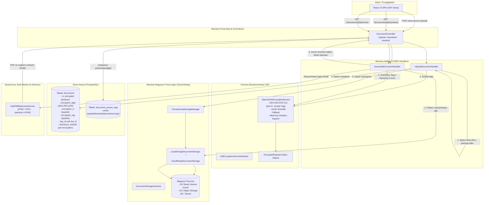
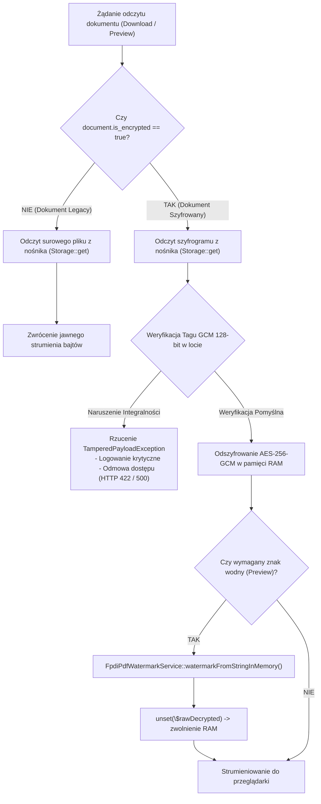

# FinBoard Architecture: Fizyczne Szyfrowanie Danych Spoczynkowych VDR (AES-256-GCM)

**Wersja:** 1.0  
**Kontekst:** Wirtualny Pokój Danych (Virtual Data Room - VDR), Bezpieczeństwo Danych Spoczynkowych (Encryption at Rest), Zgodność z RODO / M&A Due Diligence, Oracle Cloud Infrastructure (OCI)

---

## 1. Wprowadzenie i Kontekst Prawno-Biznesowy

Wirtualny Pokój Danych (**Virtual Data Room – VDR**) w platformie **FinBoard** stanowi krytyczny komponent transakcyjny wykorzystywany przez fundusze Private Equity, Venture Capital, banki inwestycyjne oraz doradców M&A (Deal Advisory) do wymiany wysoce poufnych informacji gospodarczych w procesach Due Diligence, wycen przedsiębiorstw, audytów prawno-podatkowych oraz restrukturyzacji.

Dokumenty deponowane w VDR obejmują m.in.:
- Poufne sprawozdania finansowe i audytorskie,
- Modele wyceny DCF, kalkulacje NWC i EBITDA,
- Umowy handlowe, struktury kapitałowe, rejestry akcjonariuszy,
- Dane osobowe kluczowego personelu i zarządów (zgodność z art. 32 RODO).

### Wymagania Regulacyjne i Standardy Bezpieczeństwa:
1. **Art. 32 RODO (Bezpieczeństwo przetwarzania):** Obowiązek wdrożenia odpowiednich środków technicznych i organizacyjnych, w tym w szczególności pseudonimizacji i szyfrowania danych osobowych.
2. **Model Zero-Trust Storage:** Nawet w przypadku fizycznego przejęcia nośnika danych (nieautoryzowany snapshot wolumenu blokowego OCI, wyciek kopii zapasowej, nieuprawniony dostęp personelu serwerowni), dane w spoczynku (*at rest*) muszą pozostać niemożliwe do odczytania bez dedykowanego klucza szyfrującego.
3. **Integralność i Niezaprzeczalność (Anti-Tampering):** System musi gwarantować natychmiastowe wykrycie jakiejkolwiek próby manipulacji szyfrogramem lub metadanymi pliku przed przekazaniem danych do pamięci RAM użytkownika.

W ramach **Fazy 62 (Commity 318–326)** zaimplementowano fizyczne szyfrowanie danych spoczynkowych oparte o symetryczny szyfr blokowy **AES-256-GCM** (Galois/Counter Mode) z 96-bitowym wektorem inicjalizacyjnym (IV), 128-bitowym tagiem autentyczności (AEAD), architekturą Dual-Read (Zero-Downtime Deployment), mechanizmem awaryjnym HKDF-SHA256 oraz pełną gotowością pod migrację do chmurowego magazynu obiektowego **OCI Object Storage**.

---

## 2. Model Zagrożeń (Threat Model & Security Posture)

| Wektor Zagrożenia | Ryzyko / Skutek | Mechanizm Przeciwdziałania w FinBoard |
|---|---|---|
| **Kradzież lub wyciek wolumenu OCI Block Volume** | Dostęp nieuprawnionych podmiotów do surowych plików PDF/XLSX na poziomie systemu plików. | **Fizyczne szyfrowanie AES-256-GCM:** Na nośniku składowany jest wyłącznie szyfrogram. Bez klucza `VDR_ENCRYPTION_KEY` odzyskanie tekstu jawnego jest niemożliwe. |
| **Manipulacja szyfrogramem (Bit-Flipping / Tampering)** | Zmiana zawartości dokumentu lub wstrzyknięcie złośliwego kodu przez modyfikację bajtów na dysku. | **Tag autentyczności AEAD (128-bit GCM):** Wszelka zmiana choćby 1 bitu w szyfrogramie powoduje niepowodzenie weryfikacji i rzucenie `TamperedPayloadException` (HTTP 422/500). |
| **Podmiana tagu lub wektora IV w bazie danych** | Próba wymuszenia deszyfrowania ze sfałszowanym tagiem lub IV. | **Kryptograficzna weryfikacja OpenSSL:** Próba odszyfrowania z niepasującym tagiem skutkuje natychmiastowym odrzuceniem payloadu. |
| **Brak zmiennej środowiskowej po deployu na OCI** | Błąd HTTP 500 dla wszystkich użytkowników VDR po wdrożeniu nowej wersji bez uzupełnienia `.env`. | **Automatyczny Fallback HKDF-SHA256:** Przy braku `VDR_ENCRYPTION_KEY` system bezpiecznie derywuje klucz roboczy z `APP_KEY` z wpisem ostrzegawczym w logach. |
| **Wyciek pamięci RAM na serwerze (Memory Leak / Dump)** | Pozostawienie odszyfrowanych dokumentów w buforach pamięci operacyjnej PHP. | **Jawne czyszczenie buforów (`unset`):** Bufory binarne tekstu jawnego są natychmiast niszczone po zakończeniu strumieniowania lub nałożeniu znaku wodnego. |
| **Tworzenie plików tymczasowych na dysku** | Pozostawienie jawnych fragmentów plików w `/tmp`. | **Operacje In-Memory:** Zarówno deszyfrowanie, jak i nakładanie dynamicznego znaku wodnego (`FpdiPdfWatermarkService`) odbywają się w 100% w pamięci RAM. |

---

## 3. Specyfikacja Kryptograficzna

### 3.1. Parametry Algorytmu
- **Algorytm bazowy:** AES-256 w trybie Galois/Counter Mode (**AES-256-GCM**).
- **Długość klucza:** 256 bitów (32 bajty), kodowane w formacie Base64.
- **Wektor inicjalizacyjny (IV):** 96 bitów (12 bajtów), generowany kryptograficznie bezpiecznym generatorem liczb pseudolosowych (`random_bytes(12)`). Unikalny dla każdej pojedynczej operacji szyfrowania (zakaz ponownego użycia IV dla tego samego klucza).
- **Tag autentyczności (Auth Tag):** 128 bitów (16 bajtów), generowany automatycznie przez tryb GCM OpenSSL AEAD.
- **Domyślny identyfikator klucza:** `vdr-key-1` (z obsługą rotacji wielu kluczy w `config/vdr.php`).

### 3.2. Wyprowadzanie Klucza Awaryjnego (HKDF-SHA256 Fallback)
W przypadku braku zdefiniowania dedykowanego klucza `VDR_ENCRYPTION_KEY` w środowisku produkcyjnym, serwis `OpenSslVdrEncryptionService` stosuje standard RFC 5869 (HMAC-based Extract-and-Expand Key Derivation Function):

$$\text{PRK} = \text{HMAC-SHA256}(\text{salt}=\text{""}, \text{IKM}=\text{config('app.key')})$$
$$\text{OKM} = \text{HKDF-Expand}(\text{PRK}, \text{info}=\text{"vdr-storage-aes-256-gcm"}, \text{length}=32)$$

```php
$rawKey = hash_hkdf('sha256', (string) config('app.key'), 32, 'vdr-storage-aes-256-gcm');
```
Zapewnia to deterministyczny, kryptograficznie silny 256-bitowy klucz bez przestojów w działaniu aplikacji.

---

## 4. Diagramy Architektury i Przepływu Danych

### 4.1. Architektura Ogólna Podsystemu Kryptograficznego



### 4.2. Strategia Dual-Read & Zero-Downtime Deployment

System transparentnie obsługuje koegzystencję dokumentów utworzonych przed wdrożeniem szyfrowania oraz nowo dodawanych plików:



---

## 5. Abstrakcja Magazynu Danych i Gotowość na OCI Object Storage

Zgodnie z żelazną zasadą architektoniczną nr 5, serwis kryptograficzny i obsługa dokumentów zostały całkowicie odizolowane od lokalnego systemu plików (`file_get_contents`, `realpath()`, `$disk->path()`):

1. **Operacje Czysto Strumieniowe:**
   Wszystkie operacje zapisu i odczytu korzystają z abstrakcji `Storage::disk(config('vdr.storage.disk'))`:
   - Zapis szyfrogramu: `Storage::put($path, $encryptedPayload->ciphertext)`
   - Odczyt szyfrogramu: `Storage::get($path)`
2. **Odporność na brak ścieżek lokalnych:**
   W przypadku sterowników chmurowych (np. AWS S3 kompatybilny driver dla **OCI Object Storage**), wywołanie `$disk->path()` rzuca `BadMethodCallException`. Klasy `LocalStorageDocumentStorage` oraz `CloudReadyDocumentStorage` przechwytują ten wyjątek i zwracają wirtualny identyfikator lokalizacji, zapobiegając awarii aplikacji.
3. **Atomowość Transakcyjna (`TransactionalStorageManager`):**
   Jeśli operacja zapisu rekordu w PostgreSQL zakończy się błędem (rollback transakcji bazy danych), `TransactionalStorageManager` automatycznie usuwa fizyczny plik z nośnika, zapobiegając powstawaniu osieroconych szyfrogramów.

---

## 6. Procedura Wdrożenia i Migracji na Oracle Cloud (Runbook)

### Krok 1: Wygenerowanie Klucza Szyfrującego na Serwerze OCI
Na instancji compute Oracle Cloud (np. `finboard-demo` w regionie Frankfurt `eu-frankfurt-1`) uruchom dedykowaną komendę konsolową:

```bash
docker compose -f docker-compose.prod.yml exec app php artisan vdr:key-generate
```

Komenda automatycznie:
- Wygeneruje kryptograficznie bezpieczny klucz 256-bitowy w formacie Base64,
- Zapisze go do zmiennej `VDR_ENCRYPTION_KEY` w pliku `.env`,
- Ustawi aktywny identyfikator klucza `VDR_ACTIVE_KEY_ID=vdr-key-1`.

> [!NOTE]
> Jeśli chcesz jedynie podejrzeć wygenerowany klucz bez nadpisywania pliku `.env`, użyj flagi `--show`:  
> `php artisan vdr:key-generate --show`

### Krok 2: Uruchomienie Migracji Schematu Bazy Danych
Zastosuj migrację dodającą kolumny metadanych szyfrowania do PostgreSQL:

```bash
docker compose -f docker-compose.prod.yml exec app php artisan migrate --force
```

### Krok 3: Szyfrowanie Istniejących Dokumentów Legacy na Produkcji
Aby fizycznie zaszyfrować dotychczas składowane, jawne pliki na serwerze produkcyjnym bez przerw w działaniu serwisu (Zero-Downtime):

1. **Uruchomienie symulacji (Dry-Run):**
   ```bash
   docker compose -f docker-compose.prod.yml exec app php artisan vdr:encrypt-existing-documents --dry-run
   ```
   *Weryfikuje sumy SHA-256 plików, testuje szyfrowanie i odszyfrowanie w pamięci RAM, zgłasza ewentualne pliki uszkodzone bez dotykania nośnika.*

2. **Właściwa migracja produkcyjna:**
   ```bash
   docker compose -f docker-compose.prod.yml exec app php artisan vdr:encrypt-existing-documents --chunk=50 --force
   ```
   *Przetwarza dokumenty paczkami po 50 pozycji, weryfikuje sumę SHA-256 przed i po szyfrowaniu, atomowo zapisuje szyfrogram, aktualizuje rekord w bazie i rejestruje wpis audytowy w `document_access_logs`.*

---

## 7. Polityka Rotacji Kluczy (Key Rotation Policy)

W przypadku konieczności okresowej rotacji klucza głównego (np. co 12 miesięcy lub w sytuacji incydentu bezpieczeństwa):

1. **Wygenerowanie nowego klucza:**
   Wygeneruj nowy klucz 256-bitowy poleceniem `php artisan vdr:key-generate --show`.
2. **Dodanie klucza do konfiguracji:**
   W pliku `.env` dodaj nowy klucz pod kolejnym identyfikatorem (np. `VDR_KEY_2`) oraz zaktualizuj klucz główny:
   ```env
   VDR_ENCRYPTION_KEY=nowo_wygenerowany_klucz_base64
   VDR_ACTIVE_KEY_ID=vdr-key-2
   VDR_KEY_1=poprzedni_klucz_base64
   ```
3. **Rejestracja w `config/vdr.php`:**
   Serwis `OpenSslVdrEncryptionService` automatycznie wybiera klucz odpowiadający kolumnie `documents.key_id`. Nowo wgrywane dokumenty będą natychmiast szyfrowane nowym kluczem `vdr-key-2`, a starsze dokumenty będą bezproblemowo odszyfrowywane kluczem `vdr-key-1`.
4. **Przeszyfrowanie zasobów archiwalnych:**
   Uruchomienie komendy migracyjnej z nowym identyfikatorem klucza:
   ```bash
   php artisan vdr:encrypt-existing-documents --key-id=vdr-key-2 --force
   ```

---

## 8. Efektywność Pamięciowa i Monitorowanie RAM na Instancjach OCI Ampere

Instancje **Always Free VM.Standard.A1.Flex** w chmurze Oracle posiadają ograniczone zasoby pamięci operacyjnej w zależności od alokacji (od 6 GB do 24 GB RAM). Szyfrowanie dużych plików PDF o objętości 20–50 MB mogłoby prowadzić do wyczerpania buforów PHP.

### Zastosowane Optymalizacje:
- **Przetwarzanie wsadowe `chunkById`:** Komendy konsolowe i operacje analityczne nigdy nie ładują wszystkich dokumentów naraz do kolekcji Eloquent.
- **Jawne wywoływanie `unset()`:** Zarówno w serwisach aplikacyjnych, kontrolerach, jak i komendach Artisan bufory `$rawBytes`, `$ciphertext` oraz obiekty `$payload` są niszczone w pamięci natychmiast po użyciu.
- **Brak plików tymczasowych na dysku:** Całość operacji dynamicznego nakładania znaków wodnych i podglądu odbywa się w strumieniach in-memory, eliminując zużycie operacji wejścia-wyjścia (I/O) dysku blokowego.

---

## 9. Podsumowanie Weryfikacji Bezpieczeństwa

Mechanizm fizycznego szyfrowania AES-256-GCM został poddany rygorystycznemu zestawowi testów regresyjnych i bezpieczeństwa (PHPUnit & Vitest):
- **100% PASS** w 787 testach backendowych PHPUnit (9139 asercji), w tym testy anti-tampering, weryfikacja sum kontrolnych, odporność seedera oraz fallback HKDF.
- **100% PASS** w 77 plikach testowych frontendu Vitest (696 testów), weryfikujących wskaźniki kłódki, badge AES-256 oraz transparentność Dual-Read w interfejsie użytkownika.
